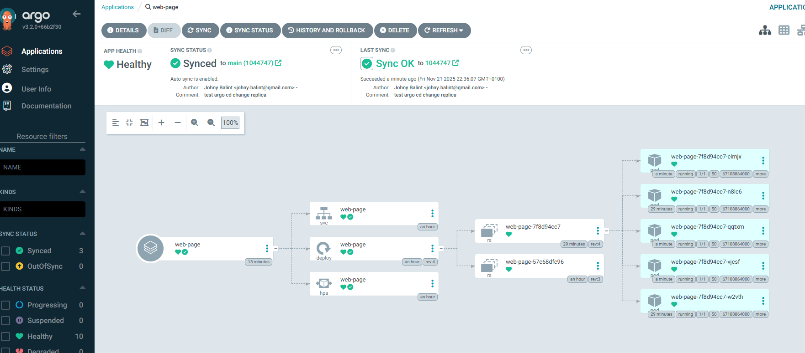

# web-page-gitops

GitOps repozitár pre projekt `web-page`.

Tento repozitár obsahuje Kubernetes/Helm manifesty, ktoré definujú, ako sa HTML stránka z aplikačného repozitára `web-page` nasadzuje do Kubernetes clustra pomocou ArgoCD.

Aplikačný kód (HTML, CSS, JS, Dockerfile, GitHub Actions) je v inom repozitári:
- `web-page` – build Docker image a push do GitHub Container Registry (GHCR)

Toto repo rieši:
- Helm chart pre nasadenie HTML stránky
- konfiguráciu image (repository, tag)
- Kubernetes objekty (Deployment, Service, prípadne Ingress)
- ArgoCD Application (GitOps správa nasadenia)

---

